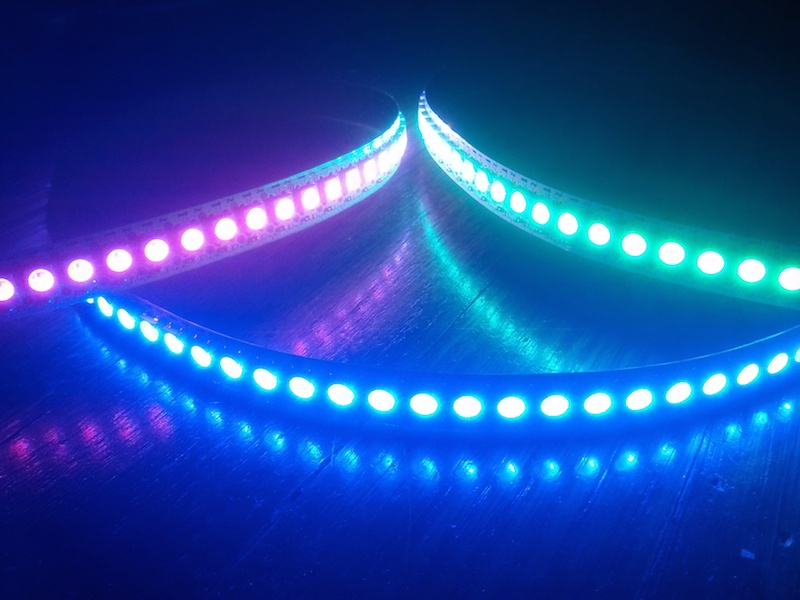

Simple Pixel
==========

Experiments with hand-tuned ASM on Arduino with addressable LEDs.

Written at [Hacker School](http://www.hackerschool.com/), Summer 2014.

This library controls popular WS2812B (aka [Neopixel](https://www.adafruit.com/search?q=neopixel)) LEDs. It has been tested to work on 16Mhz ATMega168 and ATMega328 based Arduino boards. 

If you're looking to gain a greater understanding of low-level interfacing this is a fun project. Check out AdaFruit Neopixel or FastLED for mature, full-featured libraries.

Files
=======
* simple.ino, really, really simple. Looking at timing, send a 0 or 1.
* simplecolor.ino, send rgb color values

How To Use
=======
* Aquire a 16Mhz AVR and the Arduino IDE (The library is setup for PORTD, if your device does not have this port you may have to make adjustments)
* Attach your LED strip to 5V, GND and Digital Pin 6
* Upload and run

Learning Resources
=======

AVR / Arduino

* [AVR ASM tutorials](http://www.avr-asm-tutorial.net/avr_en/beginner/)
* [AVR Beginners](http://www.avrbeginners.net/)
* [Inline AVR ASM](http://www.nongnu.org/avr-libc/user-manual/inline_asm.html)
* [Arduino Home](http://www.arduino.cc/)

Other libraries for reference

* [Adafruit Neopixel](https://github.com/adafruit/Adafruit_NeoPixel)
* [Fast LED](https://github.com/FastLED/FastLED)
* [Light WS2811](https://github.com/cpldcpu/light_ws2812)

Neopixels / WS2812B LEDs

The datasheet, Adafruit's guide and other libraries can be a good reference if you get stuck!

* [WS2812B Datasheet](./support/ws2812b.pdf)
* [Adafruit Neopixel Uberguide](https://learn.adafruit.com/adafruit-neopixel-uberguide/overview) and [Adafruit Neopixel](https://github.com/adafruit/Adafruit_NeoPixel) library
* [Bit-banging WS2811s](http://www.instructables.com/id/Bitbanging-step-by-step-Arduino-control-of-WS2811-/)
* [Advanced Secrets of Neopixels](http://wp.josh.com/2014/05/13/ws2812-neopixels-are-not-so-finicky-once-you-get-to-know-them/)

